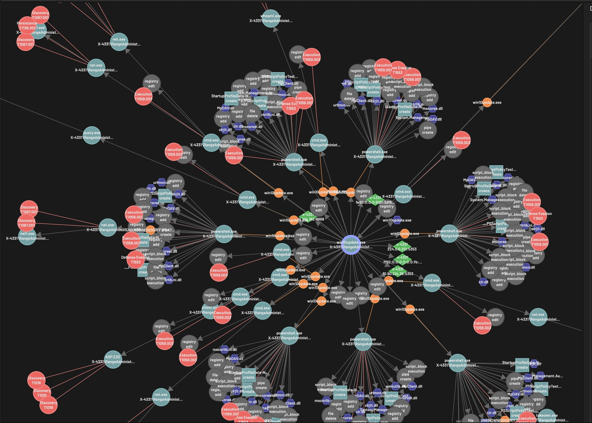

Introduction
============

*BBX* and *Rey* 
are coupled tools that together provide a baseline cyber detection and analysis capability. 
BBX is a python application that detects suspicious activity on network hosts, labels it with ATT&CK
identifiers and organizes it into causal graphs called *Activity Sets*.
Rey is a browser-based javascript application that allows an analytic user to explore these graphs along the dimensions of time, causality, TTP, and network host.
Rey users can visualize high-level sequences of TTPs over time, or drill down to study fine-grained event-level details.

The architecture diagram below illustrates the workflow for BBX and Rey.
We assume a set of networked devices (e.g., windows computer hosts) where host-based events are logged,
and additional machine(s) for analysis.
Event logs are collected to a central index, where BBX processes these logs and generates
Activity Set files. 
Rey is then used to inspect and analyze Activity Set files for patterns of suspicious behavior.

    BBX Architecture

What are Activity Sets?
-------------
An Activity Set is a graph in which nodes are suspicious events and alerts, and directed edges are causal relationships among events (e.g., parent - child process, process - network access, process - memory access). 
The figure below illustrates a malicious process and its expanding activity. The highlighted central node represents the creation of a subverted win10update.exe process;
surrounding nodes represent successive generations of child processes.
Red nodes are alerts labeled with an `ATT&CK Technique ID <https://attack.mitre.org/techniques/enterprise/>`_.

    Snapshot of an Activity Set

Activity Set graphs present a story of unfolding malicious activity over time, reducing organizational "blindness". 
They are designed to make significantly more semantic content readily accessible to human users than would be possible viewing logs of raw events (e.g., in Kibana). 
Activity Sets are relatively small because most non-malicious events have been eliminated: 
they tend to be less than 1MB. 
They can be used both forensically, or in real time (i.e. graphs are being built as events occur).
   .. A detailed definition and syntax for Activity Sets is :ref:`here <activity_sets_section>`.

What is BBX?
------------
BBX is a python program for efficiently generating activity sets from system logs.
It does the following:

1. Reads log file information from a log database such as Elasticsearch or Splunk.
2. Applies detection rules to all events in the log files, generating alerts on suspicious event patterns. (BBX comes with an out of the box set of publicly available detection rules which can be enhanced for one's local network.)
3. "Investigates" the event-level context of each alert, building out subgraphs of causally-connected events and additional secondary alerts.
4. Merges all connected subgraphs into a larger Activity Set graph.

What is Rey?
------------
Rey is a single-page web application (SPA) which runs completely in the browser, and does the following:

1. Opens one or more Activity Set files and renders them visually as a graph of nodes using a force-directed layout.
2. Allows users to pan across and zoom in on specific regions of interest, select individual events or alert, and inspect their details (e.g., process ID, timestamp, command line), and zoom out to inspect features of the entire activity set.
3. Allows users to study suspicious activity along various dimensions through a linked timeline.

You can explore an instance of Rey with a demo activity set `Here
<https://mitre.github.io/blue-agave-rey/?urls=https://raw.githubusercontent.com/mitre/blue-agave-rey/refs/heads/main/samples/activity_set_1.json>`_.
